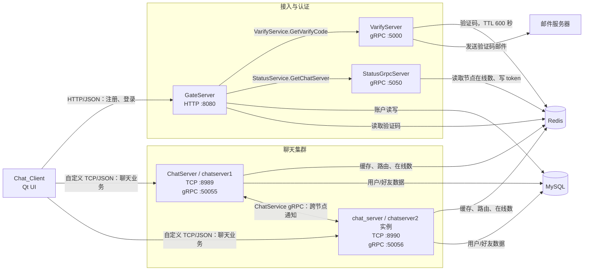
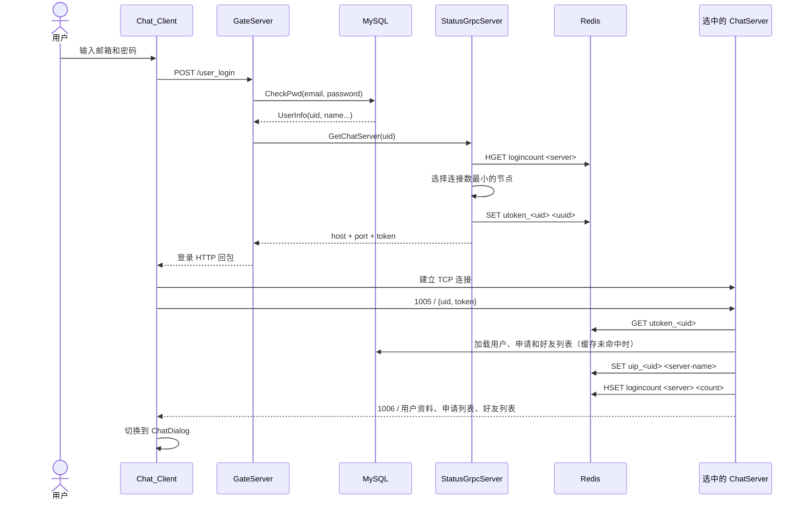
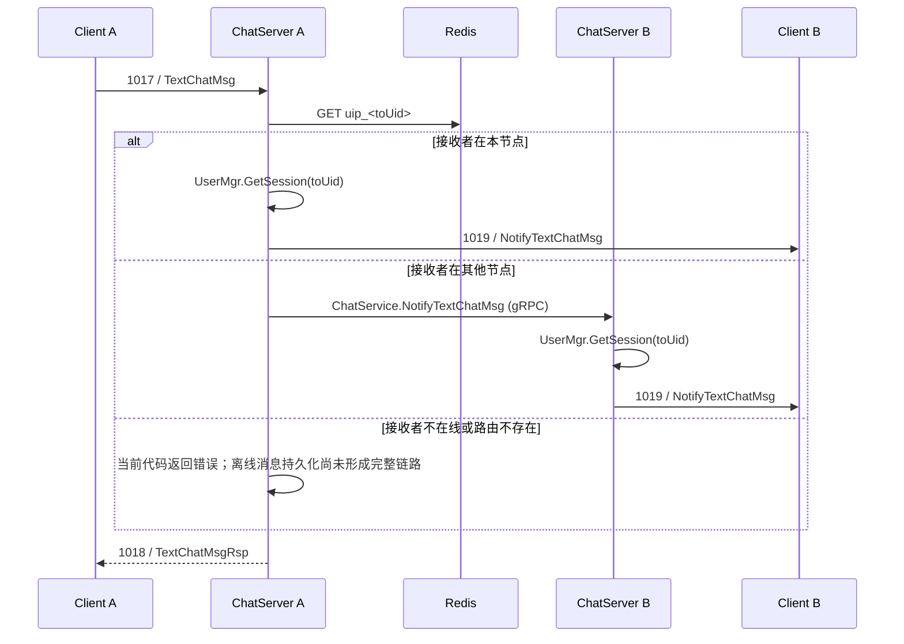
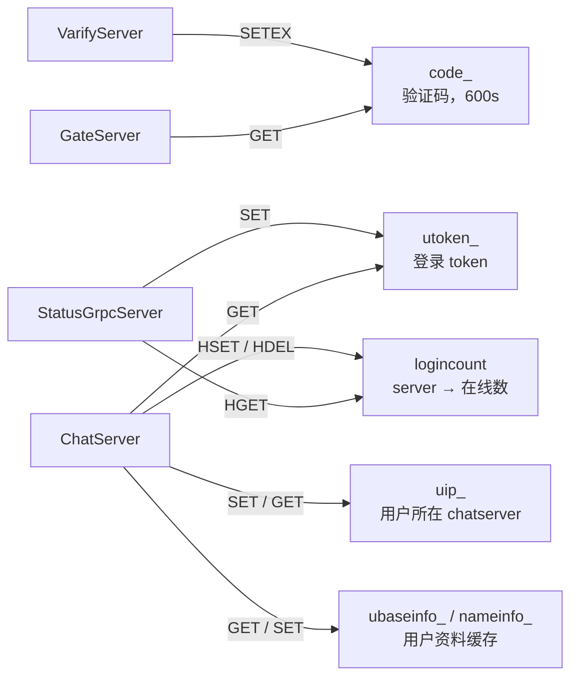

# Chat_Project Code Graph

> 基于当前源码静态分析生成。图中的实线表示源码中已确认的调用或连接，虚线表示部署/配置关系。
> 自动生成的 protobuf 文件、Qt `ui_*.h`、`node_modules`、`x64` 构建产物不作为业务节点展开。

## 1. 项目定位

这是一个采用分布式服务端架构的即时通信系统：

- `Chat_Client`：Qt 5 桌面客户端，负责注册、登录、好友关系和聊天 UI。
- `GateServer`：HTTP 接入层，处理验证码、注册、重置密码和登录。
- `VarifyServer`：Node.js gRPC 验证码服务，生成验证码、写 Redis 并发送邮件。
- `StatusGrpcServer`：聊天节点发现与负载选择服务，签发登录 token。
- `chat_server` 的两个运行实例：提供客户端 TCP 长连接和节点间 gRPC 通知。
- Redis：验证码、token、用户所在节点、节点在线数和用户信息缓存。
- MySQL：账户、用户资料、好友申请和好友关系持久化。

## 2. 系统级 Code Graph



## 3. 入口与模块依赖

```mermaid
flowchart TB
    subgraph Client[Chat_Client]
        CMain[main.cpp] --> MainWindow
        MainWindow --> AuthUI[LoginDialog / RegisterDialog / ResetDialog]
        MainWindow --> ChatUI[ChatDialog / ChatPage / 好友组件]
        AuthUI --> HttpMgr[Httpmgr]
        AuthUI --> TcpMgr[TcpMgr]
        ChatUI --> TcpMgr
        ChatUI --> ClientUserMgr[UserMgr]
        TcpMgr --> ClientUserMgr
    end

    subgraph Gate[GateServer]
        GMain[GateServer.cpp] --> GServer[CServer]
        GServer --> HttpConnection
        HttpConnection --> GLogic[LogicSystem]
        GLogic --> VerifyClient[VerifyGrpcClient]
        GLogic --> StatusClient[StatusGrpcClient]
        GLogic --> GateMysql[MysqlMgr → MysqlDao]
        GLogic --> GateRedis[RedisMgr]
    end

    subgraph Status[StatusGrpcServer]
        SMain[StatusGrpcServer.cpp] --> StatusImpl[StatusServiceImpl]
        StatusImpl --> StatusRedis[RedisMgr]
        StatusImpl --> StatusConfig[ConfigMgr]
    end

    subgraph Chat[每个 ChatServer 节点]
        ChMain[ChatServer.cpp] --> ChServer[CServer]
        ChMain --> ChatService[ChatServiceImp]
        ChServer --> Session[CSession]
        Session --> ChLogic[LogicSystem]
        ChLogic --> Worker[LogicWorker / 消息队列]
        ChLogic --> ChUserMgr[UserMgr：uid → session]
        ChLogic --> ChMysql[MysqlMgr → MysqlDao]
        ChLogic --> ChRedis[RedisMgr]
        ChLogic --> ChatGrpcClient
        ChatService --> ChUserMgr
        ChatService --> ChServer
    end

    subgraph Verify[VarifyServer]
        VMain[server.js] --> Proto[proto.js]
        VMain --> Email[email.js]
        VMain --> VRedis[redis.js]
    end
```



### 核心职责

| 组件 | 入口 | 核心调度对象 | 职责 |
|---|---|---|---|
| Qt 客户端 | `Chat_Client/Chat_Client/main.cpp` | `MainWindow`, `Httpmgr`, `TcpMgr` | UI、HTTP 短请求、TCP 长连接、消息分发 |
| HTTP 网关 | `GateServer/GateServer/GateServer.cpp` | `CServer → HttpConnection → LogicSystem` | 账户认证、验证码入口、聊天节点发现 |
| 验证码服务 | `VarifyServer/server.js` | `GetVarifyCode` | 验证码生成、Redis TTL、邮件发送 |
| 状态服务 | `StatusGrpcServer/StatusGrpcServer/StatusGrpcServer.cpp` | `StatusServiceImpl` | 按在线数选节点、签发 token |
| 聊天节点 | `ChatServer/ChatServer/ChatServer.cpp` | `CServer → CSession → LogicSystem` | TCP 会话、好友业务、文本消息、跨节点转发 |
| 节点间入口 | 同上 | `ChatServiceImp` | 接收其他聊天节点的 gRPC 通知并投递本地 session |

## 4. 登录运行链路



## 5. 文本消息运行链路



好友申请（`1009/1010/1011`）和好友认证（`1013/1014/1015`）采用同一种“Redis 查用户节点 → 本地 session 直投或 ChatService 跨节点转发”的模式。

## 6. API 与协议图谱

### GateServer HTTP

| Method | Path | 下游依赖 | 用途 |
|---|---|---|---|
| GET | `/get_test` | 无 | 健康/示例接口 |
| POST | `/post_email` | VarifyService gRPC | 获取邮箱验证码 |
| POST | `/user_register` | Redis + MySQL | 校验验证码并注册 |
| POST | `/reset_pwd` | Redis + MySQL | 校验验证码并修改密码 |
| POST | `/user_login` | MySQL + StatusService gRPC | 认证并返回聊天节点及 token |

### gRPC 服务

| Service | RPC | 调用方 | 实现方 |
|---|---|---|---|
| `VarifyService` | `GetVarifyCode` | GateServer | VarifyServer |
| `StatusService` | `GetChatServer` | GateServer | StatusGrpcServer |
| `StatusService` | `Login` | 当前主登录链路未使用 | StatusGrpcServer |
| `ChatService` | `NotifyAddFriend` | ChatServer 节点 | 目标 ChatServer 节点 |
| `ChatService` | `NotifyAuthFriend` | ChatServer 节点 | 目标 ChatServer 节点 |
| `ChatService` | `NotifyTextChatMsg` | ChatServer 节点 | 目标 ChatServer 节点 |

proto 中还声明了 `RplyAddFriend` 和 `SendChatMsg`，但当前 `ChatServiceImp` 没有覆盖为业务入口。

### 客户端 TCP 帧

```text
+------------------+------------------+----------------------+
| message_id: u16  | body_length: u16 | JSON body: N bytes   |
| big-endian       | big-endian       | UTF-8                |
+------------------+------------------+----------------------+
```

| 请求 | 响应/通知 | 业务 |
|---:|---:|---|
| 1005 | 1006 | 聊天节点登录 |
| 1007 | 1008 | 搜索用户 |
| 1009 | 1010 / 1011 | 添加好友 / 通知目标用户 |
| 1013 | 1014 / 1015 | 好友认证 / 通知目标用户 |
| 1017 | 1018 / 1019 | 文本聊天 / 通知目标用户 |
| 1021 | — | 离线通知 |
| 1023 | 1024 | 心跳 |
| 1025 | 1026 | 文件上传（仅 ChatServer1 分支出现） |

## 7. Redis 数据关系



## 8. 两个聊天节点的源码关系

两个节点现在由同一个 CMake 目标 `chat_server` 构建，分别加载 `config/chatserver1.ini` 与 `config/chatserver2.ini` 运行。旧 `ChatServer2` 复制目录已移除，因此修改聊天业务只需要维护一份源码。

## 9. 已完成的结构性修复与剩余风险

已修复：聊天节点 gRPC 端口冲突、Status 节点列表空白字符、`StatusServiceImpl::Login` 的 Redis 判断、启动脚本缺少服务、proto 漂移、明文配置提交风险和 ChatServer 双份源码漂移。

仍需继续加固：

1. 当前 TCP 与内部 gRPC 默认未启用 TLS，生产部署应增加传输加密和服务身份认证。
2. 用户密码仍沿用现有数据库字段与校验方式，生产环境应迁移到 Argon2id 或 bcrypt 等密码哈希。
3. 离线消息持久化尚未形成完整业务链路。

## 10. 阅读路径

建议按以下顺序进入代码：

1. `Chat_Client/Chat_Client/LoginDialog.cpp`：理解 HTTP 登录到 TCP 登录的切换。
2. `GateServer/GateServer/LogicSystem.cpp`：理解全部账户类 HTTP 路由。
3. `StatusGrpcServer/StatusGrpcServer/StatusServiceImpl.cpp`：理解节点选择与 token。
4. `ChatServer/ChatServer/CSession.cpp`：理解 TCP 拆包、组包和会话生命周期。
5. `ChatServer/ChatServer/LogicSystem.cpp`：理解消息号到业务回调的主分发。
6. `ChatServer/ChatServer/ChatGrpcClient.cpp` 与 `ChatServiceImp.cpp`：理解跨节点通知。
7. `Chat_Client/Chat_Client/TcpMgr.cpp`：理解客户端协议解析与 Qt signal 分发。
