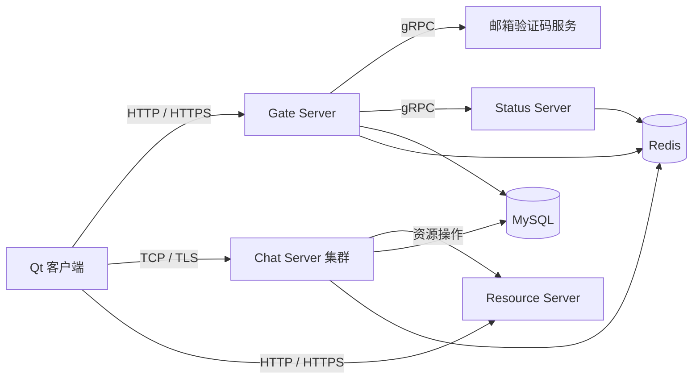

# distributed-chat-system

基于 **C++17、Qt、Boost.Asio 和 gRPC** 的分布式即时通信系统，包含桌面客户端、账号网关、聊天节点、状态服务、资源服务与邮箱验证码服务。

[构建与运行](docs/guides/build.md) · [系统架构](docs/ARCHITECTURE.md) · [文档导航](docs/README.md) · [参与贡献](CONTRIBUTING.md)

## 功能

- **账号与好友**：邮箱验证码注册、登录、密码重置与好友管理。
- **即时消息**：TCP 长连接、跨节点转发、离线消息、ACK 确认与客户端本地消息存储。
- **文件与资源**：文件分片上传、断点续传，以及独立的资源上传与下载服务。
- **多节点协作**：通过 Status 与 Redis 进行聊天节点发现、健康检查和负载选择。
- **安全与观测**：密码哈希、一次性登录票据、可配置的 TLS/mTLS，以及结构化日志。

项目包含本地开发与生产部署配置。多聊天节点不代表整套系统已具备高可用能力；默认部署中的 Gate、Status、MySQL 和 Redis 仍需单独规划冗余。

## 架构



HTTPS 与 TLS 是否启用取决于部署配置。服务职责和消息时序见 [系统架构](docs/ARCHITECTURE.md)，资源服务的接入和迁移见 [生产部署指南](deploy/production/README.md)。

| 组件 | 位置 | 职责 |
| --- | --- | --- |
| `chat_client` | `client/` | Qt 桌面界面、通信与本地消息存储 |
| `gate_server` | `servers/gate/` | 注册、登录和账号接口 |
| `status_server` | `servers/status/` | 节点选择与登录票据签发 |
| `chat_server` | `servers/chat/` | 聊天会话、消息投递与节点间 RPC |
| `resource_server` | `servers/resource/` | 资源存储与上传下载接口 |
| 验证码服务 | `VarifyServer/` | Node.js 邮箱验证码 gRPC 服务 |

## 快速开始

### 1. 准备环境

源码构建需要 CMake **3.25+**（仓库使用版本 6 的 Presets）、Ninja、C++17 编译器和 vcpkg。服务端还需要 MySQL 8、Redis 与 Node.js；Node CI 使用版本 22。桌面客户端的 CI 使用 **Qt 6.6.3 + MSVC**。

克隆仓库后，在根目录初始化依赖子模块：

```sh
git submodule update --init --recursive
```

### 2. 构建服务端

Linux：

```sh
export VCPKG_ROOT=/path/to/vcpkg
cmake --fresh --preset linux-server-release
cmake --build --preset linux-server-release -j
npm ci --prefix VarifyServer
```

Windows 请在 MSVC Developer PowerShell 中执行：

```powershell
$env:VCPKG_ROOT = 'C:\tools\vcpkg'
cmake --fresh --preset windows-server-release
cmake --build --preset windows-server-release
npm ci --prefix VarifyServer
```

### 3. 配置并运行

按 [构建与运行指南](docs/guides/build.md) 配置数据库、Redis、SMTP、内部服务凭据、文件存储和证书，再通过 `run_all` 启动本地服务。客户端构建与本地明文联调方式也在该指南中。

生产环境使用 [生产部署指南](deploy/production/README.md)；升级已有数据库时，先核对其中的迁移步骤。

**演示脚本状态**：仓库保留了 `scripts/demo.sh`，但当前缺少它依赖的 `tests/e2e/chat_e2e.py`，暂不能作为开箱即用的演示入口。测试与相关工具的适用范围见 [开发指南](docs/DEVELOPMENT.md)。

## 目录

```text
client/          Qt 桌面客户端
servers/         Gate、Status、Chat、Resource 服务
VarifyServer/    Node.js 验证码服务
common/          服务端共享组件
proto/           Protobuf 协议定义
config/          运行配置
cmake/           CMake 模块与 vcpkg triplet
third_party/     第三方子模块
scripts/         构建、启停、打包与验证入口
bench/           性能测试工具
database/       数据库结构与迁移
deploy/         容器、代理与生产部署配置
packaging/      安装包资源与第三方声明
docs/           开发、架构和专题指南
```

`build/`、个人 CMake 预设、依赖下载和运行日志属于本机产物，不需要提交。根目录的 Compose 文件保留为标准入口，各自用途见 [文档导航](docs/README.md)。

## 文档

| 目标 | 入口 |
| --- | --- |
| 构建客户端或服务端 | [构建与运行](docs/guides/build.md) |
| 开发与验证 | [开发指南](docs/DEVELOPMENT.md) |
| 理解消息投递与节点协作 | [架构与消息流](docs/ARCHITECTURE.md) |
| 部署到服务器 | [生产部署](deploy/production/README.md) · [双机部署](docs/deployment/two-server.md) |
| 配置加密通信 | [公网 TLS](docs/deployment/public-edge-tls.md) · [内部 gRPC TLS](docs/deployment/grpc-tls.md) |
| 制作 Windows 安装包 | [客户端打包](docs/guides/client-installer.md) |
| 查找其他工具和专题 | [完整文档导航](docs/README.md) |

## 贡献与许可证

欢迎提交问题反馈与 Pull Request。请附上复现步骤、运行环境和相关验证结果，详见 [贡献指南](CONTRIBUTING.md)。

仓库根目录许可证为 [Apache-2.0](LICENSE)。第三方依赖及子项目的声明见各自目录与 [第三方声明](packaging/windows/licenses/THIRD-PARTY-NOTICES.txt)。
