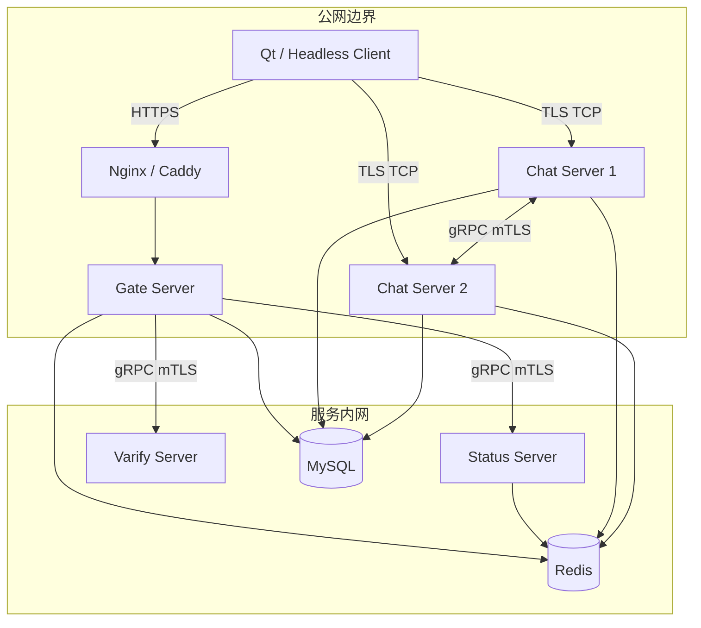
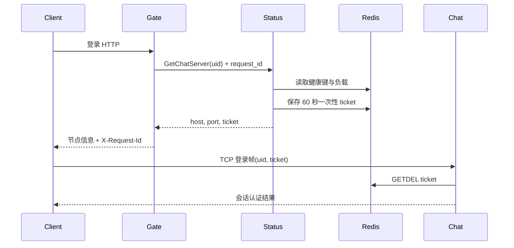
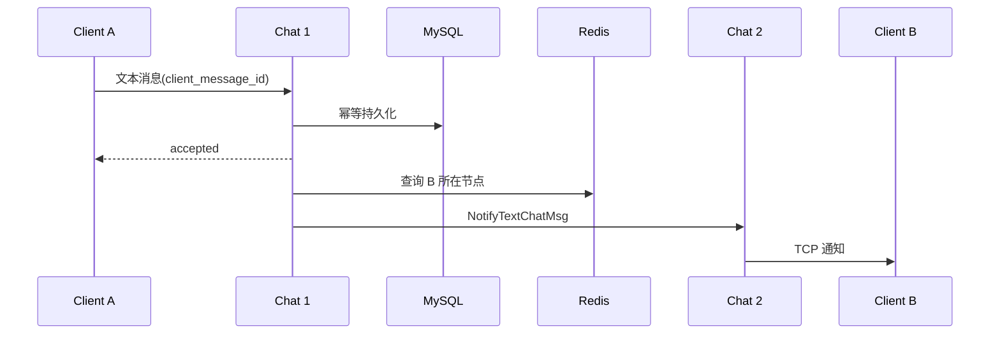
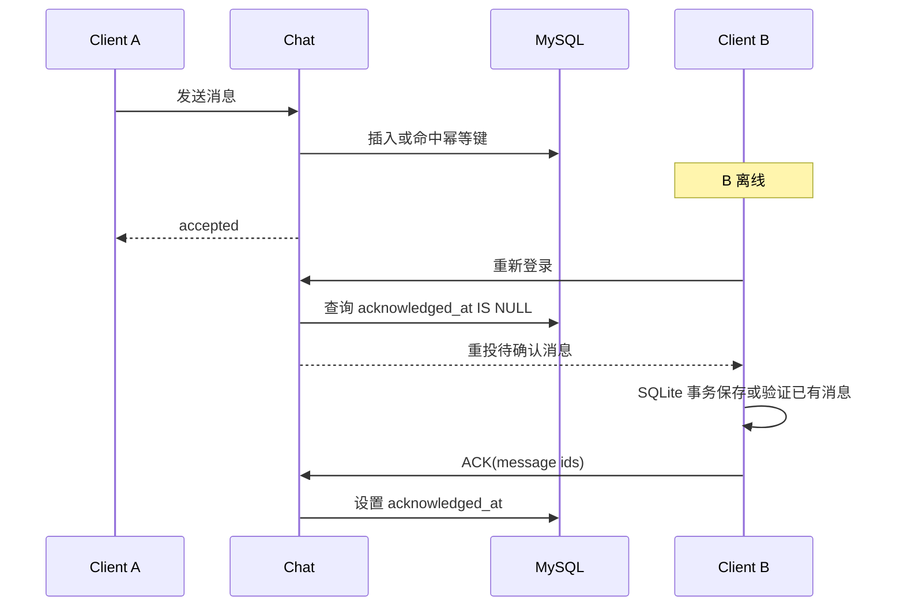
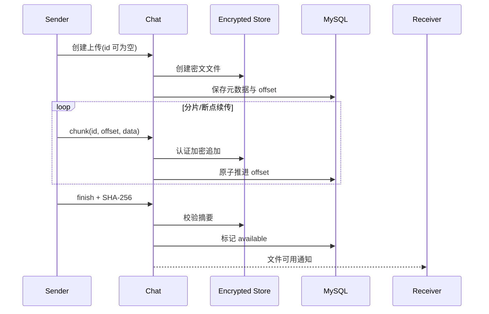

# 系统架构与消息流

## 部署拓扑与边界

Chat 节点可横向扩展并通过 Redis 健康键与连接数选路。当前 Gate、Status、Redis
和 MySQL 的默认部署仍是单实例，因此“多 Chat 节点”不等于整套系统已经高可用。
生产环境只应公开 HTTPS Gate 和 TLS Chat 入口；gRPC、Redis、MySQL 仅在内网开放。

## 登录与一次性票据

日志不记录密码或 ticket；HTTP/gRPC 使用 `request_id`，TCP 使用 `session_id` 关联。

## 跨节点消息

## 离线重投与 ACK

语义是 ACK 提交前至少一次投递，客户端以 `(sender_uid, client_message_id)` 在 SQLite 中去重；同 ID 不同内容会拒绝整个接收批次，不发 ACK。服务端通过 32 条窗口持续重投并在 ACK 后续投，数据库查询失败不会被解释为空队列。

客户端先保存 outbox 再发送，按 5、10、20、40、60 秒退避，用原 ID 重试。收到匹配的 `accepted` 回包后更新本地状态；它表示服务端已接收，不代表对方已读。登录时恢复每个好友最近 200 条消息。SQLite 文件按 Gate 地址哈希与账号 UID 隔离，位于 Qt `AppLocalDataLocation/messages` 下，使用 WAL 与 `synchronous=FULL`，目前没有本地数据库加密。断线后一次性票据不能重复使用；重新登录取得新票据后才能恢复投递。

发送草稿先作为一个事务保存，成功后才清空编辑器；JSON 序列化后的单条请求不得超过 2048 字节。接收落盘失败会关闭连接并保留服务端待确认状态。

## 过载与退出

每连接发送队列同时限制 1000 帧和 4 MiB（包含正在发送的帧）；每个文件工作队列限制 16 MiB。聊天请求桶每秒补充 100 帧、最大突发 200 帧；文件请求独立限制为每秒 128 帧、突发 256 帧，文件字节桶每秒 4 MiB、突发 8 MiB。超限连接会关闭，不会继续分配消息体；客户端待发送记录仍保留。

停机时取消尚未运行的跨节点唤醒通知，等待正在执行的通知返回，并排空已接收的业务任务。该流程没有强制终止正在运行的数据库或 RPC 调用，退出耗时仍受依赖超时影响。全局运行指标只由分片 0 上报；会话数和在途窗口数通过独立的 `runtime.shard_metrics` 上报。

## 文件传输

共享目录部署条件、不可变分片重试和系统同步顺序见 [附件恢复说明](FILE_RECOVERY.md)。数据库偏移更新失败会保留密文，后续续传重新核对状态。

